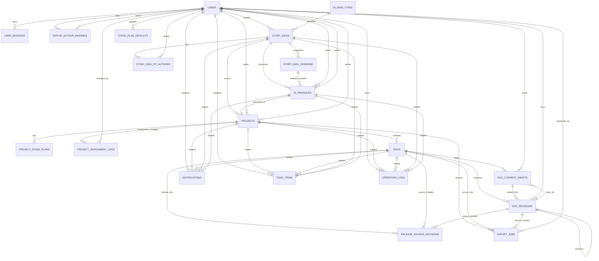

# 阅享数据库设计

> 本文从 [设计方案.md](./设计方案.md) 的「# 2. 重新设计后的数据库边界」「# 3. MySQL DDL」「# 4. ER 关系图」独立整理而来，并按 [BUS.md](./BUS.md) 审核修正。
>
> [backend/src/db/schema/database_schema.sql](../backend/src/db/schema/database_schema.sql) 已按 BUS 和设计方案的 CurrentDraft + Revision 模型全量重置。

---

## 1. 审核结论

### 1.1 总体结论

设计方案中的数据库边界和 BUS 主干一致：SI 独立于项目；项目只作为四阶段协作容器；四类阶段产出统一抽象为 Doc；Doc 采用 CurrentDraft + Revision；批注、修订、编辑建议都保存在 Tiptap JSON 内，不拆成数据库真相表；全文质检 Release 使用单独 Doc，初始化时记录来源章节 Revision。

本文件在独立整理时做了四类必要修正：

1. 角色口径修正为 `users.role ENUM('admin','editor','author')`，不再设计 `roles` / `permissions` 表。
2. 阶段编码统一使用 BUS 固定值：`synopsis`、`outline`、`chapter`、`release`。
3. Doc 状态统一使用 `draft`、`submitted`、`rejected`、`approved`。原设计里的 `returned` 已统一改为 `rejected`，页面文案仍显示为「退回待改」。
4. SI 子类型改为 `trope` 用户输入字段，不再设计后台参数表。

### 1.2 对照 BUS 的缺漏与处理

| BUS 要求 | 原设计覆盖情况 | 本文处理 |
|---|---|---|
| 权限只认 `admin` / `editor` / `author` | DDL 引用了 `roles(role_code)`，且没有创建 `roles` 表 | 改为 `users.role` 枚举；删除角色表依赖 |
| 四阶段编码固定为 `synopsis` / `outline` / `chapter` / `release` | 已覆盖 | 保持固定枚举 |
| Doc 状态与持有人一致：`draft/rejected -> author`，`submitted -> editor`，`approved -> none` | DDL 使用 `returned` | 全部改为 `rejected`，并保留 `CHECK` 兜底 |
| SI Trope 由用户直接输入，不走后台统一配置 | 原设计有独立子类型参数表和外键 | 删除独立子类型参数表，在 `story_ideas` 保留 `trope` 字段 |
| 一项目一份梗概/细纲/全文质检 Doc，正文多章节 | 已覆盖 | 保留 generated unique key 约束 |
| 同一 Doc 同一时刻最多一份 active CurrentDraft | 已覆盖 | 保留 generated unique key 约束 |
| 普通保存只更新 CurrentDraft；提交/退回/通过才生成 Revision | 已覆盖 | 在事务规则中明确 |
| Clean 正文不是独立稿件 | 已覆盖 | 仅保留 `clean_text` 派生字段 |
| 批注、修订、编辑建议不拆表 | 已覆盖 | 不设计 comments/suggestions/revision_marks 真相表 |
| 全文质检手动解锁，来源全部已通过章节 | 已覆盖但 ER 图不完整 | 增补 `release_source_revisions` 关系 |
| 通知、待办、审计覆盖关键流转 | 表已覆盖，但类型未枚举 | 保留通用表，要求应用层维护动作常量 |
| 管理员可设置阶段默认时长 | 已覆盖 | 保留 `stage_plan_defaults` |
| 项目归属调整后留痕 | 已覆盖但 ER 图未展示 | 增补 `project_assignment_logs` |
| 导出任务 | DDL 覆盖，ER 图未展示 | 增补 `export_jobs` |

### 1.3 数据库不能单独保证的规则

以下规则涉及跨表状态或业务身份，MySQL 约束只能兜底，必须由 service 事务强制：

- 当前保存用户必须匹配 Doc 所属项目的作者或编辑，并匹配 `docs.holder_role`。
- `doc_current_drafts.owner_role` 必须与 `docs.holder_role` 一致。
- `docs.active_draft_id` 必须指向同一 Doc 且状态为 `active` 的 CurrentDraft。
- `docs.final_revision_id` 必须指向同一 Doc 的 `editor_approve` Revision。
- Release 解锁必须满足所有正文 Doc 已通过，且由编辑手动触发。
- `release_source_revisions.source_revision_id` 必须属于对应 `source_chapter_doc_id`，且是最终通过 Revision。
- 未解锁阶段可以保存草稿但不能提交；全文质检未解锁前不能保存或提交。
- 编辑预发 SI 只能发给自己绑定的作者。

---

## 2. 重新设计后的数据库边界

```text
用户 / 身份 / 会话
  ├─ users
  ├─ user_sessions
  └─ editor_author_bindings

SI 选题库
  ├─ si_main_types
  ├─ story_ideas
  ├─ story_idea_versions
  ├─ story_idea_fit_authors
  └─ si_preissues

项目容器
  ├─ projects
  ├─ stage_plan_defaults
  ├─ project_stage_plans
  └─ project_assignment_logs

Doc 协作核心
  ├─ docs
  ├─ doc_current_drafts
  ├─ doc_revisions
  └─ release_source_revisions

通知 / 待办 / 审计 / 导出
  ├─ notifications
  ├─ todo_items
  ├─ operation_logs
  └─ export_jobs
```

边界原则：

- SI 版本历史和 Doc Revision 是两套历史，不能混用。
- Project 不承载稿件状态；`status`、`holder_role`、`active_draft_id`、`latest_revision_id`、`final_revision_id` 属于 Doc。
- Doc 的完整 Tiptap JSON 是内容真相源；`plain_text`、`clean_text`、`export_text`、`word_count`、统计计数都只是派生字段。
- 不单独建立 comments、suggestions、revision_marks 表作为真相源。
- SI 主类型是后台参数；Trope 是 `story_ideas` 上的用户输入字段，不建统一配置表。
- Release / 全文质检是 `doc_type='release'` 的 Doc，不是独立 release 正文表。
- `database_schema.sql` 已与 CurrentDraft + Revision 目标模型对齐，Release / 全文质检继续作为 `doc_type='release'` 的 Doc。

---

## 3. MySQL DDL

以下 DDL 面向 MySQL 8.0+。数据库名按当前环境变量建议使用 `yxwriting`；若部署环境另有命名，只替换 `CREATE DATABASE` / `USE` 即可。

```sql
-- MySQL 8.0+
-- Engine: InnoDB
-- Charset: utf8mb4

CREATE DATABASE IF NOT EXISTS yxwriting
  DEFAULT CHARACTER SET utf8mb4
  DEFAULT COLLATE utf8mb4_0900_ai_ci;

USE yxwriting;

CREATE TABLE users (
  user_id BIGINT UNSIGNED AUTO_INCREMENT PRIMARY KEY,

  username VARCHAR(100) NOT NULL,
  email VARCHAR(255) NOT NULL,
  password_hash VARCHAR(255) NOT NULL,

  role ENUM('admin', 'editor', 'author') NOT NULL,

  status ENUM('active', 'disabled', 'pending', 'rejected')
    NOT NULL DEFAULT 'pending',

  display_name VARCHAR(100) NULL,
  phone VARCHAR(32) NULL,
  avatar_url VARCHAR(500) NULL,

  approved_by BIGINT UNSIGNED NULL,
  approved_at DATETIME(3) NULL,
  rejected_reason TEXT NULL,

  last_login_at DATETIME(3) NULL,

  created_at DATETIME(3) NOT NULL DEFAULT CURRENT_TIMESTAMP(3),
  updated_at DATETIME(3) NOT NULL DEFAULT CURRENT_TIMESTAMP(3)
    ON UPDATE CURRENT_TIMESTAMP(3),

  UNIQUE KEY uk_users_username (username),
  UNIQUE KEY uk_users_email (email),
  KEY idx_users_role_status (role, status),

  CONSTRAINT fk_users_approved_by
    FOREIGN KEY (approved_by) REFERENCES users(user_id)
) ENGINE=InnoDB DEFAULT CHARSET=utf8mb4 COLLATE=utf8mb4_0900_ai_ci;

CREATE TABLE user_sessions (
  session_id CHAR(64) PRIMARY KEY,
  user_id BIGINT UNSIGNED NOT NULL,
  expires_at DATETIME(3) NOT NULL,
  revoked_at DATETIME(3) NULL,
  created_at DATETIME(3) NOT NULL DEFAULT CURRENT_TIMESTAMP(3),

  KEY idx_user_sessions_user (user_id),
  KEY idx_user_sessions_expires (expires_at),

  CONSTRAINT fk_user_sessions_user
    FOREIGN KEY (user_id) REFERENCES users(user_id)
) ENGINE=InnoDB DEFAULT CHARSET=utf8mb4 COLLATE=utf8mb4_0900_ai_ci;

CREATE TABLE editor_author_bindings (
  binding_id BIGINT UNSIGNED AUTO_INCREMENT PRIMARY KEY,

  editor_id BIGINT UNSIGNED NOT NULL,
  author_id BIGINT UNSIGNED NOT NULL,

  status ENUM('active', 'inactive') NOT NULL DEFAULT 'active',

  bound_by BIGINT UNSIGNED NOT NULL,
  bound_at DATETIME(3) NOT NULL DEFAULT CURRENT_TIMESTAMP(3),
  unbound_by BIGINT UNSIGNED NULL,
  unbound_at DATETIME(3) NULL,

  note TEXT NULL,

  active_pair_key VARCHAR(191)
    GENERATED ALWAYS AS (
      CASE
        WHEN status = 'active'
        THEN CONCAT(editor_id, ':', author_id)
        ELSE NULL
      END
    ) STORED,

  UNIQUE KEY uk_editor_author_active (active_pair_key),
  KEY idx_editor_author_editor (editor_id, status),
  KEY idx_editor_author_author (author_id, status),

  CONSTRAINT fk_editor_author_editor
    FOREIGN KEY (editor_id) REFERENCES users(user_id),

  CONSTRAINT fk_editor_author_author
    FOREIGN KEY (author_id) REFERENCES users(user_id),

  CONSTRAINT fk_editor_author_bound_by
    FOREIGN KEY (bound_by) REFERENCES users(user_id),

  CONSTRAINT fk_editor_author_unbound_by
    FOREIGN KEY (unbound_by) REFERENCES users(user_id),

  CONSTRAINT chk_editor_author_not_same
    CHECK (editor_id <> author_id)
) ENGINE=InnoDB DEFAULT CHARSET=utf8mb4 COLLATE=utf8mb4_0900_ai_ci;

CREATE TABLE si_main_types (
  main_type_id BIGINT UNSIGNED AUTO_INCREMENT PRIMARY KEY,
  code VARCHAR(64) NOT NULL,
  name VARCHAR(100) NOT NULL,
  sort_order INT UNSIGNED NOT NULL DEFAULT 0,
  is_active BOOLEAN NOT NULL DEFAULT TRUE,

  created_at DATETIME(3) NOT NULL DEFAULT CURRENT_TIMESTAMP(3),
  updated_at DATETIME(3) NOT NULL DEFAULT CURRENT_TIMESTAMP(3)
    ON UPDATE CURRENT_TIMESTAMP(3),

  UNIQUE KEY uk_si_main_types_code (code),
  KEY idx_si_main_types_active_sort (is_active, sort_order)
) ENGINE=InnoDB DEFAULT CHARSET=utf8mb4 COLLATE=utf8mb4_0900_ai_ci;

CREATE TABLE story_ideas (
  si_id BIGINT UNSIGNED AUTO_INCREMENT PRIMARY KEY,

  title VARCHAR(255) NOT NULL,

  main_type_id BIGINT UNSIGNED NULL,
  trope VARCHAR(255) NULL,

  benchmark_books JSON NULL,

  fit_author_note TEXT NULL,
  remarks TEXT NULL,
  fresh_twist TEXT NULL,
  core_synopsis MEDIUMTEXT NULL,

  creator_editor_id BIGINT UNSIGNED NOT NULL,

  status ENUM('draft', 'preissued', 'converted', 'archived')
    NOT NULL DEFAULT 'draft',

  current_version_no INT UNSIGNED NOT NULL DEFAULT 0,
  latest_version_id BIGINT UNSIGNED NULL,

  created_at DATETIME(3) NOT NULL DEFAULT CURRENT_TIMESTAMP(3),
  updated_at DATETIME(3) NOT NULL DEFAULT CURRENT_TIMESTAMP(3)
    ON UPDATE CURRENT_TIMESTAMP(3),
  archived_at DATETIME(3) NULL,

  KEY idx_story_ideas_editor_status (creator_editor_id, status),
  KEY idx_story_ideas_type (main_type_id),
  KEY idx_story_ideas_trope (trope),

  CONSTRAINT fk_story_ideas_main_type
    FOREIGN KEY (main_type_id) REFERENCES si_main_types(main_type_id),

  CONSTRAINT fk_story_ideas_creator_editor
    FOREIGN KEY (creator_editor_id) REFERENCES users(user_id)
) ENGINE=InnoDB DEFAULT CHARSET=utf8mb4 COLLATE=utf8mb4_0900_ai_ci;

CREATE TABLE story_idea_versions (
  si_version_id BIGINT UNSIGNED AUTO_INCREMENT PRIMARY KEY,

  si_id BIGINT UNSIGNED NOT NULL,
  version_no INT UNSIGNED NOT NULL,

  action ENUM('create', 'update', 'rollback') NOT NULL DEFAULT 'update',

  snapshot_json JSON NOT NULL,

  editor_id BIGINT UNSIGNED NOT NULL,

  rollback_from_version_id BIGINT UNSIGNED NULL,

  content_hash CHAR(64) NULL,

  created_at DATETIME(3) NOT NULL DEFAULT CURRENT_TIMESTAMP(3),

  UNIQUE KEY uk_si_versions_no (si_id, version_no),
  KEY idx_si_versions_si_created (si_id, created_at),
  KEY idx_si_versions_editor (editor_id),

  CONSTRAINT fk_si_versions_si
    FOREIGN KEY (si_id) REFERENCES story_ideas(si_id),

  CONSTRAINT fk_si_versions_editor
    FOREIGN KEY (editor_id) REFERENCES users(user_id),

  CONSTRAINT fk_si_versions_rollback_from
    FOREIGN KEY (rollback_from_version_id)
    REFERENCES story_idea_versions(si_version_id)
) ENGINE=InnoDB DEFAULT CHARSET=utf8mb4 COLLATE=utf8mb4_0900_ai_ci;

ALTER TABLE story_ideas
  ADD CONSTRAINT fk_story_ideas_latest_version
  FOREIGN KEY (latest_version_id)
  REFERENCES story_idea_versions(si_version_id);

CREATE TABLE story_idea_fit_authors (
  si_id BIGINT UNSIGNED NOT NULL,
  author_id BIGINT UNSIGNED NOT NULL,

  note TEXT NULL,

  created_at DATETIME(3) NOT NULL DEFAULT CURRENT_TIMESTAMP(3),

  PRIMARY KEY (si_id, author_id),

  CONSTRAINT fk_si_fit_authors_si
    FOREIGN KEY (si_id) REFERENCES story_ideas(si_id),

  CONSTRAINT fk_si_fit_authors_author
    FOREIGN KEY (author_id) REFERENCES users(user_id)
) ENGINE=InnoDB DEFAULT CHARSET=utf8mb4 COLLATE=utf8mb4_0900_ai_ci;

CREATE TABLE si_preissues (
  preissue_id BIGINT UNSIGNED AUTO_INCREMENT PRIMARY KEY,

  si_id BIGINT UNSIGNED NOT NULL,
  si_version_id BIGINT UNSIGNED NULL,

  editor_id BIGINT UNSIGNED NOT NULL,
  author_id BIGINT UNSIGNED NOT NULL,

  preissue_note TEXT NULL,

  si_snapshot_json JSON NOT NULL,

  status ENUM('preissued', 'converted', 'recalled')
    NOT NULL DEFAULT 'preissued',

  project_id BIGINT UNSIGNED NULL,

  preissued_at DATETIME(3) NOT NULL DEFAULT CURRENT_TIMESTAMP(3),
  recalled_at DATETIME(3) NULL,
  converted_at DATETIME(3) NULL,

  created_at DATETIME(3) NOT NULL DEFAULT CURRENT_TIMESTAMP(3),
  updated_at DATETIME(3) NOT NULL DEFAULT CURRENT_TIMESTAMP(3)
    ON UPDATE CURRENT_TIMESTAMP(3),

  effective_pair_key VARCHAR(191)
    GENERATED ALWAYS AS (
      CASE
        WHEN status IN ('preissued', 'converted')
        THEN CONCAT(si_id, ':', author_id)
        ELSE NULL
      END
    ) STORED,

  UNIQUE KEY uk_si_preissues_effective_pair (effective_pair_key),
  KEY idx_si_preissues_author_status (author_id, status),
  KEY idx_si_preissues_editor_status (editor_id, status),
  KEY idx_si_preissues_si_status (si_id, status),
  KEY idx_si_preissues_project (project_id),

  CONSTRAINT fk_si_preissues_si
    FOREIGN KEY (si_id) REFERENCES story_ideas(si_id),

  CONSTRAINT fk_si_preissues_si_version
    FOREIGN KEY (si_version_id) REFERENCES story_idea_versions(si_version_id),

  CONSTRAINT fk_si_preissues_editor
    FOREIGN KEY (editor_id) REFERENCES users(user_id),

  CONSTRAINT fk_si_preissues_author
    FOREIGN KEY (author_id) REFERENCES users(user_id)
) ENGINE=InnoDB DEFAULT CHARSET=utf8mb4 COLLATE=utf8mb4_0900_ai_ci;

CREATE TABLE projects (
  project_id BIGINT UNSIGNED AUTO_INCREMENT PRIMARY KEY,

  source_si_id BIGINT UNSIGNED NOT NULL,
  si_preissue_id BIGINT UNSIGNED NOT NULL,

  title VARCHAR(255) NOT NULL,
  intro TEXT NULL,

  editor_id BIGINT UNSIGNED NOT NULL,
  author_id BIGINT UNSIGNED NOT NULL,

  lifecycle_status ENUM('draft', 'active', 'completed', 'archived', 'cancelled')
    NOT NULL DEFAULT 'active',

  current_stage ENUM('synopsis', 'outline', 'chapter', 'release', 'completed')
    NOT NULL DEFAULT 'synopsis',

  release_status ENUM('locked', 'unlocked', 'approved')
    NOT NULL DEFAULT 'locked',

  completed_at DATETIME(3) NULL,
  archived_at DATETIME(3) NULL,
  cancelled_at DATETIME(3) NULL,
  restored_at DATETIME(3) NULL,

  created_by BIGINT UNSIGNED NOT NULL,

  created_at DATETIME(3) NOT NULL DEFAULT CURRENT_TIMESTAMP(3),
  updated_at DATETIME(3) NOT NULL DEFAULT CURRENT_TIMESTAMP(3)
    ON UPDATE CURRENT_TIMESTAMP(3),

  UNIQUE KEY uk_projects_preissue (si_preissue_id),
  KEY idx_projects_editor_status (editor_id, lifecycle_status, current_stage),
  KEY idx_projects_author_status (author_id, lifecycle_status, current_stage),
  KEY idx_projects_source_si (source_si_id),

  CONSTRAINT fk_projects_source_si
    FOREIGN KEY (source_si_id) REFERENCES story_ideas(si_id),

  CONSTRAINT fk_projects_preissue
    FOREIGN KEY (si_preissue_id) REFERENCES si_preissues(preissue_id),

  CONSTRAINT fk_projects_editor
    FOREIGN KEY (editor_id) REFERENCES users(user_id),

  CONSTRAINT fk_projects_author
    FOREIGN KEY (author_id) REFERENCES users(user_id),

  CONSTRAINT fk_projects_created_by
    FOREIGN KEY (created_by) REFERENCES users(user_id),

  CONSTRAINT chk_projects_editor_author_not_same
    CHECK (editor_id <> author_id)
) ENGINE=InnoDB DEFAULT CHARSET=utf8mb4 COLLATE=utf8mb4_0900_ai_ci;

ALTER TABLE si_preissues
  ADD CONSTRAINT fk_si_preissues_project
  FOREIGN KEY (project_id) REFERENCES projects(project_id);

CREATE TABLE stage_plan_defaults (
  stage_code ENUM('synopsis', 'outline', 'chapter', 'release')
    NOT NULL PRIMARY KEY,

  default_plan_days INT UNSIGNED NOT NULL,
  warning_days_before_due INT UNSIGNED NOT NULL DEFAULT 1,

  updated_by BIGINT UNSIGNED NULL,
  updated_at DATETIME(3) NOT NULL DEFAULT CURRENT_TIMESTAMP(3)
    ON UPDATE CURRENT_TIMESTAMP(3),

  CONSTRAINT fk_stage_plan_defaults_updated_by
    FOREIGN KEY (updated_by) REFERENCES users(user_id)
) ENGINE=InnoDB DEFAULT CHARSET=utf8mb4 COLLATE=utf8mb4_0900_ai_ci;

CREATE TABLE project_stage_plans (
  stage_plan_id BIGINT UNSIGNED AUTO_INCREMENT PRIMARY KEY,

  project_id BIGINT UNSIGNED NOT NULL,

  stage_code ENUM('synopsis', 'outline', 'chapter', 'release')
    NOT NULL,

  gate_status ENUM('locked', 'unlocked', 'completed')
    NOT NULL DEFAULT 'locked',

  timeline_status ENUM('not_started', 'in_progress', 'due_soon', 'overdue', 'completed')
    NOT NULL DEFAULT 'not_started',

  plan_days INT UNSIGNED NOT NULL,

  unlocked_at DATETIME(3) NULL,
  started_at DATETIME(3) NULL,
  due_at DATETIME(3) NULL,
  completed_at DATETIME(3) NULL,

  created_at DATETIME(3) NOT NULL DEFAULT CURRENT_TIMESTAMP(3),
  updated_at DATETIME(3) NOT NULL DEFAULT CURRENT_TIMESTAMP(3)
    ON UPDATE CURRENT_TIMESTAMP(3),

  UNIQUE KEY uk_project_stage_plans_project_stage (project_id, stage_code),
  KEY idx_project_stage_plans_status (stage_code, gate_status, timeline_status),
  KEY idx_project_stage_plans_due (due_at, timeline_status),

  CONSTRAINT fk_project_stage_plans_project
    FOREIGN KEY (project_id) REFERENCES projects(project_id)
) ENGINE=InnoDB DEFAULT CHARSET=utf8mb4 COLLATE=utf8mb4_0900_ai_ci;

CREATE TABLE project_assignment_logs (
  assignment_log_id BIGINT UNSIGNED AUTO_INCREMENT PRIMARY KEY,

  project_id BIGINT UNSIGNED NOT NULL,

  old_editor_id BIGINT UNSIGNED NULL,
  new_editor_id BIGINT UNSIGNED NULL,

  old_author_id BIGINT UNSIGNED NULL,
  new_author_id BIGINT UNSIGNED NULL,

  changed_by BIGINT UNSIGNED NOT NULL,
  reason TEXT NULL,

  created_at DATETIME(3) NOT NULL DEFAULT CURRENT_TIMESTAMP(3),

  KEY idx_project_assignment_logs_project (project_id, created_at),

  CONSTRAINT fk_project_assignment_logs_project
    FOREIGN KEY (project_id) REFERENCES projects(project_id),

  CONSTRAINT fk_project_assignment_logs_old_editor
    FOREIGN KEY (old_editor_id) REFERENCES users(user_id),

  CONSTRAINT fk_project_assignment_logs_new_editor
    FOREIGN KEY (new_editor_id) REFERENCES users(user_id),

  CONSTRAINT fk_project_assignment_logs_old_author
    FOREIGN KEY (old_author_id) REFERENCES users(user_id),

  CONSTRAINT fk_project_assignment_logs_new_author
    FOREIGN KEY (new_author_id) REFERENCES users(user_id),

  CONSTRAINT fk_project_assignment_logs_changed_by
    FOREIGN KEY (changed_by) REFERENCES users(user_id)
) ENGINE=InnoDB DEFAULT CHARSET=utf8mb4 COLLATE=utf8mb4_0900_ai_ci;

CREATE TABLE docs (
  doc_id BIGINT UNSIGNED AUTO_INCREMENT PRIMARY KEY,

  project_id BIGINT UNSIGNED NOT NULL,

  doc_type ENUM('synopsis', 'outline', 'chapter', 'release')
    NOT NULL,

  stage_code ENUM('synopsis', 'outline', 'chapter', 'release')
    NOT NULL,

  title VARCHAR(255) NOT NULL,

  chapter_no INT UNSIGNED NULL,
  sort_order INT UNSIGNED NOT NULL DEFAULT 0,

  status ENUM('draft', 'submitted', 'rejected', 'approved')
    NOT NULL DEFAULT 'draft',

  holder_role ENUM('author', 'editor', 'none')
    NOT NULL DEFAULT 'author',

  active_draft_id BIGINT UNSIGNED NULL,
  latest_revision_id BIGINT UNSIGNED NULL,
  final_revision_id BIGINT UNSIGNED NULL,

  current_word_count INT UNSIGNED NOT NULL DEFAULT 0,
  current_plain_text MEDIUMTEXT NULL,
  current_clean_text MEDIUMTEXT NULL,
  summary TEXT NULL,

  last_action ENUM(
    'author_save',
    'author_submit',
    'editor_save',
    'editor_reject',
    'editor_approve',
    'admin_reopen'
  ) NULL,

  last_actor_id BIGINT UNSIGNED NULL,
  last_action_at DATETIME(3) NULL,
  last_handoff_note TEXT NULL,

  submitted_at DATETIME(3) NULL,
  reviewed_at DATETIME(3) NULL,
  approved_at DATETIME(3) NULL,

  is_deleted BOOLEAN NOT NULL DEFAULT FALSE,

  created_at DATETIME(3) NOT NULL DEFAULT CURRENT_TIMESTAMP(3),
  updated_at DATETIME(3) NOT NULL DEFAULT CURRENT_TIMESTAMP(3)
    ON UPDATE CURRENT_TIMESTAMP(3),

  single_doc_key VARCHAR(191)
    GENERATED ALWAYS AS (
      CASE
        WHEN doc_type IN ('synopsis', 'outline', 'release')
        THEN CONCAT(project_id, ':', doc_type)
        ELSE NULL
      END
    ) STORED,

  chapter_order_key VARCHAR(191)
    GENERATED ALWAYS AS (
      CASE
        WHEN doc_type = 'chapter'
        THEN CONCAT(project_id, ':', LPAD(sort_order, 10, '0'))
        ELSE NULL
      END
    ) STORED,

  UNIQUE KEY uk_docs_single_doc (single_doc_key),
  UNIQUE KEY uk_docs_chapter_order (chapter_order_key),

  KEY idx_docs_project_type_status (project_id, doc_type, status),
  KEY idx_docs_project_stage (project_id, stage_code),
  KEY idx_docs_holder_status (holder_role, status),
  KEY idx_docs_last_action_at (last_action_at),
  KEY idx_docs_last_actor (last_actor_id),

  CONSTRAINT fk_docs_project
    FOREIGN KEY (project_id) REFERENCES projects(project_id),

  CONSTRAINT fk_docs_last_actor
    FOREIGN KEY (last_actor_id) REFERENCES users(user_id),

  CONSTRAINT chk_docs_status_holder
    CHECK (
      (status IN ('draft', 'rejected') AND holder_role = 'author')
      OR
      (status = 'submitted' AND holder_role = 'editor')
      OR
      (status = 'approved' AND holder_role = 'none')
    )
) ENGINE=InnoDB DEFAULT CHARSET=utf8mb4 COLLATE=utf8mb4_0900_ai_ci;

CREATE TABLE doc_current_drafts (
  draft_id BIGINT UNSIGNED AUTO_INCREMENT PRIMARY KEY,

  doc_id BIGINT UNSIGNED NOT NULL,

  owner_role ENUM('author', 'editor') NOT NULL,
  owner_user_id BIGINT UNSIGNED NOT NULL,

  base_revision_id BIGINT UNSIGNED NULL,

  content_schema_version INT UNSIGNED NOT NULL DEFAULT 1,

  content_json JSON NOT NULL,

  word_count INT UNSIGNED NOT NULL DEFAULT 0,
  plain_text MEDIUMTEXT NULL,
  clean_text MEDIUMTEXT NULL,
  export_text MEDIUMTEXT NULL,
  summary TEXT NULL,

  comment_count INT UNSIGNED NOT NULL DEFAULT 0,
  suggestion_count INT UNSIGNED NOT NULL DEFAULT 0,
  revision_mark_count INT UNSIGNED NOT NULL DEFAULT 0,

  status ENUM('active', 'sealed', 'archived')
    NOT NULL DEFAULT 'active',

  lock_version INT UNSIGNED NOT NULL DEFAULT 0,
  save_count INT UNSIGNED NOT NULL DEFAULT 0,

  created_at DATETIME(3) NOT NULL DEFAULT CURRENT_TIMESTAMP(3),
  updated_at DATETIME(3) NOT NULL DEFAULT CURRENT_TIMESTAMP(3)
    ON UPDATE CURRENT_TIMESTAMP(3),
  sealed_at DATETIME(3) NULL,

  active_doc_key BIGINT UNSIGNED
    GENERATED ALWAYS AS (
      CASE
        WHEN status = 'active'
        THEN doc_id
        ELSE NULL
      END
    ) STORED,

  UNIQUE KEY uk_doc_current_drafts_one_active (active_doc_key),

  KEY idx_doc_current_drafts_doc_status (doc_id, status),
  KEY idx_doc_current_drafts_owner (owner_user_id, owner_role),
  KEY idx_doc_current_drafts_base_revision (base_revision_id),

  CONSTRAINT fk_doc_current_drafts_doc
    FOREIGN KEY (doc_id) REFERENCES docs(doc_id),

  CONSTRAINT fk_doc_current_drafts_owner
    FOREIGN KEY (owner_user_id) REFERENCES users(user_id)
) ENGINE=InnoDB DEFAULT CHARSET=utf8mb4 COLLATE=utf8mb4_0900_ai_ci;

CREATE TABLE doc_revisions (
  revision_id BIGINT UNSIGNED AUTO_INCREMENT PRIMARY KEY,

  doc_id BIGINT UNSIGNED NOT NULL,

  revision_no INT UNSIGNED NOT NULL,

  base_revision_id BIGINT UNSIGNED NULL,
  from_draft_id BIGINT UNSIGNED NOT NULL,

  content_schema_version INT UNSIGNED NOT NULL DEFAULT 1,

  content_json JSON NOT NULL,

  word_count INT UNSIGNED NOT NULL DEFAULT 0,
  plain_text MEDIUMTEXT NULL,
  clean_text MEDIUMTEXT NULL,
  export_text MEDIUMTEXT NULL,
  summary TEXT NULL,

  comment_count INT UNSIGNED NOT NULL DEFAULT 0,
  suggestion_count INT UNSIGNED NOT NULL DEFAULT 0,
  revision_mark_count INT UNSIGNED NOT NULL DEFAULT 0,

  action ENUM('author_submit', 'editor_reject', 'editor_approve')
    NOT NULL,

  actor_role ENUM('author', 'editor', 'admin')
    NOT NULL,

  actor_user_id BIGINT UNSIGNED NOT NULL,

  handoff_note TEXT NULL,

  content_hash CHAR(64) NULL,

  created_at DATETIME(3) NOT NULL DEFAULT CURRENT_TIMESTAMP(3),

  UNIQUE KEY uk_doc_revisions_doc_no (doc_id, revision_no),
  KEY idx_doc_revisions_doc_created (doc_id, created_at),
  KEY idx_doc_revisions_base (base_revision_id),
  KEY idx_doc_revisions_actor (actor_user_id, actor_role),
  KEY idx_doc_revisions_action_created (action, created_at),

  CONSTRAINT fk_doc_revisions_doc
    FOREIGN KEY (doc_id) REFERENCES docs(doc_id),

  CONSTRAINT fk_doc_revisions_base
    FOREIGN KEY (base_revision_id) REFERENCES doc_revisions(revision_id),

  CONSTRAINT fk_doc_revisions_from_draft
    FOREIGN KEY (from_draft_id) REFERENCES doc_current_drafts(draft_id),

  CONSTRAINT fk_doc_revisions_actor
    FOREIGN KEY (actor_user_id) REFERENCES users(user_id),

  CONSTRAINT chk_doc_revisions_action_actor
    CHECK (
      (action = 'author_submit' AND actor_role = 'author')
      OR
      (action IN ('editor_reject', 'editor_approve') AND actor_role IN ('editor', 'admin'))
    )
) ENGINE=InnoDB DEFAULT CHARSET=utf8mb4 COLLATE=utf8mb4_0900_ai_ci;

ALTER TABLE doc_current_drafts
  ADD CONSTRAINT fk_doc_current_drafts_base_revision
  FOREIGN KEY (base_revision_id)
  REFERENCES doc_revisions(revision_id);

ALTER TABLE docs
  ADD CONSTRAINT fk_docs_active_draft
  FOREIGN KEY (active_draft_id)
  REFERENCES doc_current_drafts(draft_id);

ALTER TABLE docs
  ADD CONSTRAINT fk_docs_latest_revision
  FOREIGN KEY (latest_revision_id)
  REFERENCES doc_revisions(revision_id);

ALTER TABLE docs
  ADD CONSTRAINT fk_docs_final_revision
  FOREIGN KEY (final_revision_id)
  REFERENCES doc_revisions(revision_id);

CREATE TABLE release_source_revisions (
  release_source_id BIGINT UNSIGNED AUTO_INCREMENT PRIMARY KEY,

  project_id BIGINT UNSIGNED NOT NULL,

  release_doc_id BIGINT UNSIGNED NOT NULL,

  source_chapter_doc_id BIGINT UNSIGNED NOT NULL,
  source_revision_id BIGINT UNSIGNED NOT NULL,

  source_order INT UNSIGNED NOT NULL,

  created_at DATETIME(3) NOT NULL DEFAULT CURRENT_TIMESTAMP(3),

  UNIQUE KEY uk_release_source_doc (
    release_doc_id,
    source_chapter_doc_id
  ),

  KEY idx_release_source_project (project_id),
  KEY idx_release_source_revision (source_revision_id),

  CONSTRAINT fk_release_source_project
    FOREIGN KEY (project_id) REFERENCES projects(project_id),

  CONSTRAINT fk_release_source_release_doc
    FOREIGN KEY (release_doc_id) REFERENCES docs(doc_id),

  CONSTRAINT fk_release_source_chapter_doc
    FOREIGN KEY (source_chapter_doc_id) REFERENCES docs(doc_id),

  CONSTRAINT fk_release_source_revision
    FOREIGN KEY (source_revision_id) REFERENCES doc_revisions(revision_id)
) ENGINE=InnoDB DEFAULT CHARSET=utf8mb4 COLLATE=utf8mb4_0900_ai_ci;

CREATE TABLE notifications (
  notification_id BIGINT UNSIGNED AUTO_INCREMENT PRIMARY KEY,

  recipient_user_id BIGINT UNSIGNED NOT NULL,

  type VARCHAR(64) NOT NULL,

  title VARCHAR(255) NOT NULL,
  body TEXT NULL,

  project_id BIGINT UNSIGNED NULL,
  doc_id BIGINT UNSIGNED NULL,
  si_id BIGINT UNSIGNED NULL,
  preissue_id BIGINT UNSIGNED NULL,

  entity_type VARCHAR(64) NULL,
  entity_id BIGINT UNSIGNED NULL,

  is_read BOOLEAN NOT NULL DEFAULT FALSE,
  read_at DATETIME(3) NULL,

  created_at DATETIME(3) NOT NULL DEFAULT CURRENT_TIMESTAMP(3),

  KEY idx_notifications_user_read_created (
    recipient_user_id,
    is_read,
    created_at
  ),
  KEY idx_notifications_project (project_id),
  KEY idx_notifications_doc (doc_id),
  KEY idx_notifications_si (si_id),

  CONSTRAINT fk_notifications_user
    FOREIGN KEY (recipient_user_id) REFERENCES users(user_id),

  CONSTRAINT fk_notifications_project
    FOREIGN KEY (project_id) REFERENCES projects(project_id),

  CONSTRAINT fk_notifications_doc
    FOREIGN KEY (doc_id) REFERENCES docs(doc_id),

  CONSTRAINT fk_notifications_si
    FOREIGN KEY (si_id) REFERENCES story_ideas(si_id),

  CONSTRAINT fk_notifications_preissue
    FOREIGN KEY (preissue_id) REFERENCES si_preissues(preissue_id)
) ENGINE=InnoDB DEFAULT CHARSET=utf8mb4 COLLATE=utf8mb4_0900_ai_ci;

CREATE TABLE todo_items (
  todo_id BIGINT UNSIGNED AUTO_INCREMENT PRIMARY KEY,

  recipient_user_id BIGINT UNSIGNED NOT NULL,

  todo_type VARCHAR(64) NOT NULL,

  title VARCHAR(255) NOT NULL,
  description TEXT NULL,

  project_id BIGINT UNSIGNED NULL,
  doc_id BIGINT UNSIGNED NULL,
  si_id BIGINT UNSIGNED NULL,
  preissue_id BIGINT UNSIGNED NULL,

  entity_type VARCHAR(64) NULL,
  entity_id BIGINT UNSIGNED NULL,

  status ENUM('open', 'done', 'cancelled')
    NOT NULL DEFAULT 'open',

  due_at DATETIME(3) NULL,
  completed_at DATETIME(3) NULL,
  cancelled_at DATETIME(3) NULL,

  dedupe_key VARCHAR(191) NULL,

  open_dedupe_key VARCHAR(191)
    GENERATED ALWAYS AS (
      CASE
        WHEN status = 'open'
        THEN dedupe_key
        ELSE NULL
      END
    ) STORED,

  created_at DATETIME(3) NOT NULL DEFAULT CURRENT_TIMESTAMP(3),
  updated_at DATETIME(3) NOT NULL DEFAULT CURRENT_TIMESTAMP(3)
    ON UPDATE CURRENT_TIMESTAMP(3),

  UNIQUE KEY uk_todo_items_open_dedupe (open_dedupe_key),
  KEY idx_todo_items_user_status_due (
    recipient_user_id,
    status,
    due_at
  ),
  KEY idx_todo_items_project (project_id),
  KEY idx_todo_items_doc (doc_id),

  CONSTRAINT fk_todo_items_user
    FOREIGN KEY (recipient_user_id) REFERENCES users(user_id),

  CONSTRAINT fk_todo_items_project
    FOREIGN KEY (project_id) REFERENCES projects(project_id),

  CONSTRAINT fk_todo_items_doc
    FOREIGN KEY (doc_id) REFERENCES docs(doc_id),

  CONSTRAINT fk_todo_items_si
    FOREIGN KEY (si_id) REFERENCES story_ideas(si_id),

  CONSTRAINT fk_todo_items_preissue
    FOREIGN KEY (preissue_id) REFERENCES si_preissues(preissue_id)
) ENGINE=InnoDB DEFAULT CHARSET=utf8mb4 COLLATE=utf8mb4_0900_ai_ci;

CREATE TABLE operation_logs (
  log_id BIGINT UNSIGNED AUTO_INCREMENT PRIMARY KEY,

  actor_user_id BIGINT UNSIGNED NULL,
  actor_role VARCHAR(32) NULL,

  action VARCHAR(128) NOT NULL,

  entity_type VARCHAR(64) NOT NULL,
  entity_id BIGINT UNSIGNED NOT NULL,

  project_id BIGINT UNSIGNED NULL,
  doc_id BIGINT UNSIGNED NULL,
  si_id BIGINT UNSIGNED NULL,
  preissue_id BIGINT UNSIGNED NULL,

  request_id VARCHAR(128) NULL,
  ip_address VARCHAR(64) NULL,
  user_agent VARCHAR(500) NULL,

  before_json JSON NULL,
  after_json JSON NULL,
  metadata_json JSON NULL,

  created_at DATETIME(3) NOT NULL DEFAULT CURRENT_TIMESTAMP(3),

  KEY idx_operation_logs_actor_created (actor_user_id, created_at),
  KEY idx_operation_logs_entity (entity_type, entity_id),
  KEY idx_operation_logs_project_created (project_id, created_at),
  KEY idx_operation_logs_doc_created (doc_id, created_at),
  KEY idx_operation_logs_action_created (action, created_at),

  CONSTRAINT fk_operation_logs_actor
    FOREIGN KEY (actor_user_id) REFERENCES users(user_id),

  CONSTRAINT fk_operation_logs_project
    FOREIGN KEY (project_id) REFERENCES projects(project_id),

  CONSTRAINT fk_operation_logs_doc
    FOREIGN KEY (doc_id) REFERENCES docs(doc_id),

  CONSTRAINT fk_operation_logs_si
    FOREIGN KEY (si_id) REFERENCES story_ideas(si_id),

  CONSTRAINT fk_operation_logs_preissue
    FOREIGN KEY (preissue_id) REFERENCES si_preissues(preissue_id)
) ENGINE=InnoDB DEFAULT CHARSET=utf8mb4 COLLATE=utf8mb4_0900_ai_ci;

CREATE TABLE export_jobs (
  export_job_id BIGINT UNSIGNED AUTO_INCREMENT PRIMARY KEY,

  project_id BIGINT UNSIGNED NOT NULL,

  scope ENUM('synopsis', 'outline', 'chapters', 'release', 'project')
    NOT NULL,

  format ENUM('docx', 'markdown')
    NOT NULL DEFAULT 'docx',

  source_doc_id BIGINT UNSIGNED NULL,
  source_revision_id BIGINT UNSIGNED NULL,

  status ENUM('pending', 'running', 'completed', 'failed')
    NOT NULL DEFAULT 'pending',

  file_path VARCHAR(1000) NULL,
  error_message TEXT NULL,

  requested_by BIGINT UNSIGNED NOT NULL,

  created_at DATETIME(3) NOT NULL DEFAULT CURRENT_TIMESTAMP(3),
  started_at DATETIME(3) NULL,
  completed_at DATETIME(3) NULL,

  KEY idx_export_jobs_project_created (project_id, created_at),
  KEY idx_export_jobs_requested_by (requested_by, created_at),
  KEY idx_export_jobs_status (status),

  CONSTRAINT fk_export_jobs_project
    FOREIGN KEY (project_id) REFERENCES projects(project_id),

  CONSTRAINT fk_export_jobs_source_doc
    FOREIGN KEY (source_doc_id) REFERENCES docs(doc_id),

  CONSTRAINT fk_export_jobs_source_revision
    FOREIGN KEY (source_revision_id) REFERENCES doc_revisions(revision_id),

  CONSTRAINT fk_export_jobs_requested_by
    FOREIGN KEY (requested_by) REFERENCES users(user_id)
) ENGINE=InnoDB DEFAULT CHARSET=utf8mb4 COLLATE=utf8mb4_0900_ai_ci;
```

### 3.1 Revision 不可变约束

正式环境建议启用以下触发器，防止历史快照被误更新或删除。开发环境可以暂不启用，避免调试迁移时过早受限。

```sql
DELIMITER //

CREATE TRIGGER trg_doc_revisions_no_update
BEFORE UPDATE ON doc_revisions
FOR EACH ROW
BEGIN
  SIGNAL SQLSTATE '45000'
    SET MESSAGE_TEXT = 'doc_revisions are immutable';
END//

CREATE TRIGGER trg_doc_revisions_no_delete
BEFORE DELETE ON doc_revisions
FOR EACH ROW
BEGIN
  SIGNAL SQLSTATE '45000'
    SET MESSAGE_TEXT = 'doc_revisions cannot be deleted';
END//

CREATE TRIGGER trg_story_idea_versions_no_update
BEFORE UPDATE ON story_idea_versions
FOR EACH ROW
BEGIN
  SIGNAL SQLSTATE '45000'
    SET MESSAGE_TEXT = 'story_idea_versions are immutable';
END//

CREATE TRIGGER trg_story_idea_versions_no_delete
BEFORE DELETE ON story_idea_versions
FOR EACH ROW
BEGIN
  SIGNAL SQLSTATE '45000'
    SET MESSAGE_TEXT = 'story_idea_versions cannot be deleted';
END//

DELIMITER ;
```

### 3.2 CurrentDraft 乐观锁保存

所有保存 Doc 内容的接口必须携带 `lockVersion`。保存成功只更新 CurrentDraft，不生成 Revision。

```sql
UPDATE doc_current_drafts
SET
  content_json = ?,
  word_count = ?,
  plain_text = ?,
  clean_text = ?,
  export_text = ?,
  summary = ?,
  comment_count = ?,
  suggestion_count = ?,
  revision_mark_count = ?,
  lock_version = lock_version + 1,
  save_count = save_count + 1,
  updated_at = CURRENT_TIMESTAMP(3)
WHERE draft_id = ?
  AND status = 'active'
  AND lock_version = ?;
```

如果影响行数为 0，即为多窗口保存冲突或草稿状态已变化。

### 3.3 阶段门禁编码

```text
synopsis:
  项目创建后 unlocked

outline:
  梗概 Doc approved 后 unlocked

chapter:
  细纲 Doc approved 后 unlocked

release:
  所有 chapter Doc approved 后，编辑手动 unlock
```

全文质检必须手动解锁，不能在所有正文通过后自动解锁。

---

## 4. ER 关系图



---

## 5. 当前实现口径

当前 SQL 按全量重建方式落地，不再兼容历史提交审核模型：

- Doc 内容只通过 `doc_current_drafts` 与 `doc_revisions` 表承载。
- 全文质检真相源是 `doc_type='release'` 的 Doc，来源章节快照写入 `release_source_revisions`。
- 阶段编码只使用 `synopsis`、`outline`、`chapter`、`release`。
- 批注、建议、修订不拆表保存，只作为 Tiptap JSON 的结构化内容。
- 用户角色只认 `users.role` 的 `admin`、`editor`、`author`。

---

## 6. 实施待办

1. 持续补齐端到端用例，覆盖 Doc 保存、提交、退回、通过、Release 手动解锁和导出。
2. 为通知、待办、操作日志建立动作常量表或 TypeScript 常量，避免随接口散落字符串。
3. 迁移 Tiptap 编辑器前，先固定 `content_json` 根节点 attrs 与 block id 校验逻辑。
4. 后端接口全部按 `admin` / `editor` / `author` 做服务端访问控制，前端隐藏按钮只作为 UX。
